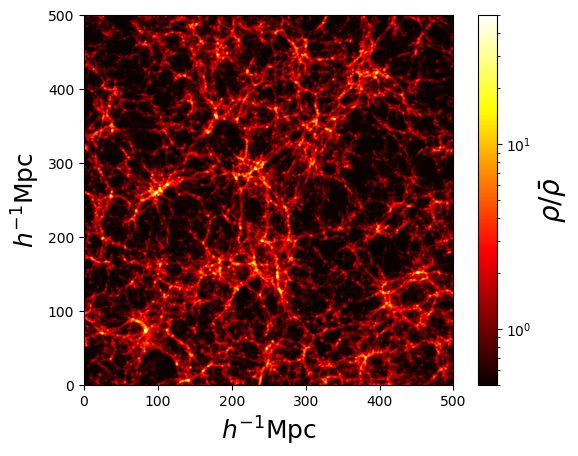

*****
Plots
*****

Pylians provides a set of routines to quickly make plots of density fields of simulations. For instance, to generate the density field of a slice of a Gadget N-body snapshot, the ingredients needed are:

- ``snapshot``. This is the name of the snapshot. For instance, ``snapdir_004/snap_004``. Note that only the prefix is needed. If e.g. ``snapdir_004`` is a folder that contains multiple subfiles, ``snapdir_004/snap_004.0``, ``snapdir_004/snap_004.1``...etc, ``snapshot`` should be set to ``snapdir_004/snap_004``.
- ``x_min``, ``x_max``, ``y_min``, ``y_max``, ``z_min``, ``z_max``. These are the coordinates of the considered region.
- ``grid``. Resolution of the image, that will have grid x grid pixels.
- ``ptypes``. Particle type over which compute the density field. It can be individual types, ``[0]`` (gas), ``[1]`` (cold dark matter), ``[2]`` (neutrinos), ``[3]`` (particle type 3), ``[4]`` (stars), ``[5]`` (black holes), or combinations. E.g. ``[0,1]`` (gas+cold dark matter), ``[0,4]`` (gas+stars), ``[0,1,2,4]`` (gas+CDM+neutrinos+stars). For all components (total matter) use ``[0,1,2,3,4,5]`` or ``[-1]``.
- ``plane``. Plane over which project the region. Can be ``'XY'``, ``'XZ'`` or ``'YZ'``.
- ``MAS``. Mass-assignment scheme used to generate the density field. Possible options are ``'NGP'``, ``'CIC'``, ``'TSC'``, ``'PCS'``.
- ``save_df``. Whether save the density field or not. It can be useful to save the field, and don't have to recompute it, when only changing the colors, overdensities values...etc.

One example on how to use Pylians to plots the density field of a snapshot is this

.. code-block::

   import numpy as np
   import plotting_library as PL
   from pylab import *
   from matplotlib.colors import LogNorm

   #snapshot name
   snapshot = '/mnt/ceph/users/fvillaescusa/Quijote/Snapshots/latin_hypercube_HR/0/snapdir_004/snap_004'

   # density field parameters
   x_min, x_max = 0.0, 500.0
   y_min, y_max = 0.0, 500.0
   z_min, z_max = 0.0, 20.0
   grid         = 1024
   ptypes       = [1]   # 0-Gas, 1-CDM, 2-NU, 4-Stars; can deal with several species
   plane        = 'XY'  #'XY','YZ' or 'XZ'
   MAS          = 'PCS' #'NGP', 'CIC', 'TSC', 'PCS' 
   save_df      = True  #whether save the density field into a file

   # image parameters
   fout            = 'Image.png'
   min_overdensity = 0.5      #minimum overdensity to plot
   max_overdensity = 50.0    #maximum overdensity to plot
   scale           = 'log' #'linear' or 'log'
   cmap            = 'hot'

   # compute 2D overdensity field
   dx, x, dy, y, overdensity = PL.density_field_2D(snapshot, x_min, x_max, y_min, y_max,
                                                   z_min, z_max, grid, ptypes, plane, MAS, save_df)

   # plot density field
   print('\nCreating the figure...')
   fig = figure()    #create the figure
   ax1 = fig.add_subplot(111) 

   ax1.set_xlim([x, x+dx])  #set the range for the x-axis
   ax1.set_ylim([y, y+dy])  #set the range for the y-axis

   ax1.set_xlabel(r'$h^{-1}{\rm Mpc}$',fontsize=18)  #x-axis label
   ax1.set_ylabel(r'$h^{-1}{\rm Mpc}$',fontsize=18)  #y-axis label

   if min_overdensity==None:  min_overdensity = np.min(overdensity)
   if max_overdensity==None:  max_overdensity = np.max(overdensity)

   overdensity[np.where(overdensity<min_overdensity)] = min_overdensity

   if scale=='linear':
         cax = ax1.imshow(overdensity,cmap=get_cmap(cmap),origin='lower',
	                  extent=[x, x+dx, y, y+dy], interpolation='bicubic',
                          vmin=min_overdensity,vmax=max_overdensity)
   else:
         cax = ax1.imshow(overdensity,cmap=get_cmap(cmap),origin='lower',
	                  extent=[x, x+dx, y, y+dy], interpolation='bicubic',
                          norm = LogNorm(vmin=min_overdensity,vmax=max_overdensity))

   cbar = fig.colorbar(cax)
   cbar.set_label(r"$\rho/\bar{\rho}$",fontsize=20)
   savefig(fout, bbox_inches='tight')
   close(fig)

The above script, on one of the `Quijote simulations <https://quijote-simulations.readthedocs.io>`_ produces the following image:

