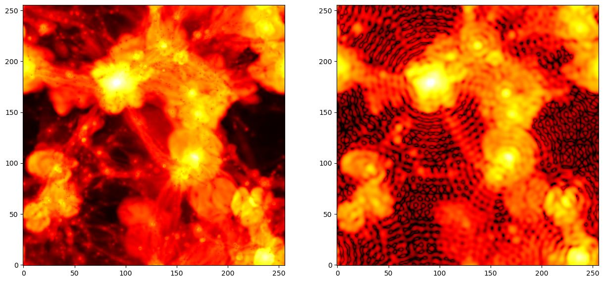

.. _smoothing: 

*********
Smoothing
*********

Pylians provides routines to smooth fields with several filters. The ingredients needed are:

- ``field``. This is a 3D float numpy array that contains the input field to be smoothed.
- ``BoxSize``. This is the size of the box with the input density field. 
- ``R``. This is the smoothing scale. This argument only matter for filters operating in configuration space: ``Top-Hat`` and ``Gaussian``. For other filters, set this value to ``0``.
- ``grid``. This is the grid size of the input field, i.e. ``field.shape[0]``.
- ``threads``. Number of openmp threads to be used.
- ``Filter``. Filter to use. ``'Top-Hat'``, ``'Gaussian'`` or ``'Top-Hat-k'``.
- ``kmin``. The minimum value of the wavenumber when using the ``Top-Hat-k`` filter. This argument only need to be specified when using this filter. 
- ``kmax``. The maximum value of the wavenumber when using the ``Top-Hat-k`` filter. This argument only need to be specified when using this filter. 
- ``W_k``. This is a 3D complex64 numpy array containing the Fourier-transform of the filter. Notice that when smoothing a discrete field, like the one stored on a regular grid, the Fourier-transform of the filter need to be computed in the same way as the for the field, i.e. through DFT instead of FT.

An example is this

.. code-block:: python

   import smoothing_library as SL

   BoxSize = 75.0 #Mpc/h
   R       = 5.0  #Mpc.h
   grid    = field.shape[0]
   Filter  = 'Top-Hat'
   threads = 28

   # compute FFT of the filter
   W_k = SL.FT_filter(BoxSize, R, grid, Filter, threads)

   # smooth the field
   field_smoothed = SL.field_smoothing(field, W_k, threads)

Pylians can also smooth 2D maps by adding ``_2D`` to the smoothing routines:

.. code-block:: python

   import smoothing_library as SL
   import numpy as np

   # we take as field a temperature image from the CAMELS Multifield Dataset
   f_map = 'CMD/2D_maps/data/Maps_T_IllustrisTNG_CV_z=0.00.npy'
   field = np.load(f_map)[0] #only take the first image

   BoxSize = 25.0 #Mpc/h
   grid    = field.shape[0]
   R       = 0.0 #only matter for configuration space filters
   Filter  = 'Top-Hat-k'
   threads = 1
   kmin    = 0  #h/Mpc
   kmax    = 10 #h/Mpc

   # compute the filter in Fourier space
   W_k = SL.FT_filter_2D(BoxSize, R, grid, Filter, threads, kmin, kmax)

   # smooth the field
   field_smoothed = SL.field_smoothing_2D(field, W_k, threads)
   

