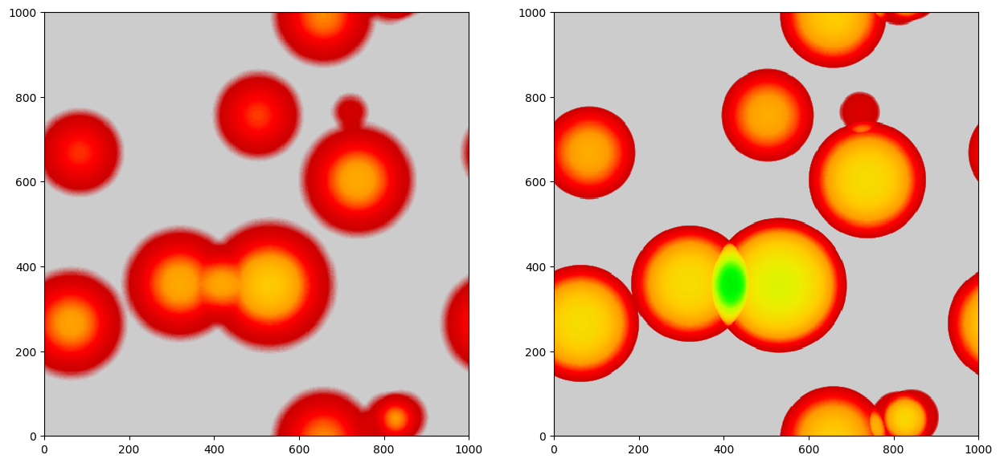

*****
Voids
*****

Pylians can be used to identify voids in a generic density field (e.g. total matter, CDM, gas, halos, neutrinos, CDM+gas, galaxies...etc). The ingredients needed are:

- ``delta``. This is the considered field; usually the density constrast: :math:`\delta=\rho/\bar{\rho}-1`. It should be a 3 dimensional float numpy array such ``delta = np.zeros((grid, grid, grid), dtype=np.float32)``. See :ref:`density_fields` on how to generate  density fields using Pylians.
- ``BoxSize``. Size of the periodic box. The units of the output power spectrum depend on this.
- ``threshold``. The routine will identify voids with mean overdensity ``(1+threshold)``. This value is typically -0.7 or -0.8, but can be higher (e.g. -0.5), depending on your needs. 
- ``Radii``. This is a ``np.float32`` 1-dimension array containing the radii of the voids to identify. It doesn't need to be sorted. In general, the minimum void size should be ~4x-5x the grid size. E.g. if you have box of 1000 Mpc/h and a grid with ``1000^3`` cells, the minimum void size should be of 4-5 Mpc/h. It is better to choose the Radii such as their are multiples of the grid size. For the previous examples this will be good: ``Radii = np.array([4, 6, 8, 10, 12, 14, 16, 18, 20, 22, 25, 28, 31, 34, 37, 40, 45, 50, 55], dtype=np.float32)``. 
- ``threads1``. The void finder routine is openmp parallelized. Set this to the maximum number of cpus per node.
- ``threads2``. Some routines are slower using all available cores. for those, we use a smaller number of cores. This number is typically 4 at most.
- ``void_field``. The routine can return a 3-dimension field filled with 0 (no void) and 1 (void) from the identified voids. If you want this set ``void_field=True``.

The void finder routine works as follows:

.. code-block:: python
		
   import numpy as np
   import void_library as VL

   # parameters of the void finder
   BoxSize    = 1000.0 #Mpc/h
   threshold  = -0.7
   Radii      = np.array([5, 7, 9, 11, 13, 15, 17, 19, 21, 23, 25, 27, 29, 31,
		          33, 35, 37, 39, 41, 44, 47, 50, 53, 56], dtype=np.float32) #Mpc/h
   threads1   = 16
   threads2   = 4
   void_field = False

   # identify voids
   V = VL.void_finder(field, BoxSize, threshold, Radii, threads1, threads2, void_field=void_field)
   void_pos    = V.void_pos    #positions of the void centers
   void_radius = V.void_radius #radius of the voids
   VSF_R       = V.Rbins       #bins in radius for VSF(void size function)
   VSF         = V.void_vsf    #VSF (#voids/volume/dR)
   if void_field:  void_field  = V.void_field

----

Method
------

Pylians3 uses the spherical overdensity void finder described in `Banerjee & Dalal 2016 <https://ui.adsabs.harvard.edu/abs/2016JCAP...11..015B>`__. We provide an example on how spherical voids can be easily identified with the void finder routine available in Pylians3:

.. code-block:: python

   # This script takes an uniform density field and places random spheres
   # of random sizes with a profile of delta(r)=-1*(1-(r/R)^3).
   # Then it identifies the voids using the void finder. Finally, it plots the
   # average density field across the entire box of the input and recovered void field.
   import numpy as np 
   import sys,os,time
   import void_library as VL
   from pylab import *
   from matplotlib.colors import LogNorm

   ############################### INPUT #####################################
   BoxSize = 1000.0 #Mpc/h
   Nvoids  = 10     #number of random voids 
   dims    = 512    #grid resolution to find voids

   threshold = -0.5 #for delta(r)=-1*(1-(r/R)^3)

   Rmax = 200.0   #maximum radius of the input voids
   Rmin = 20.0    #minimum radius of the input voids
   bins = 50      #number of radii between Rmin and Rmax to find voids

   threads1 = 16 #openmp threads
   threads2 = 4

   f_out = 'Spheres_test.png'
   ###########################################################################

   # create density field with random spheres
   V = VL.random_spheres(BoxSize, Rmin, Rmax, Nvoids, dims)
   delta = V.delta

   # find voids
   Radii = np.logspace(np.log10(Rmin), np.log10(Rmax), bins+1, dtype=np.float32)
   V2 = VL.void_finder(delta, BoxSize, threshold, Radii, 
		       threads1, threads2, void_field=True)
   delta2 = V2.in_void

   # print the positions and radius of the generated voids
   pos1 = V.void_pos
   R1   = V.void_radius
   pos2 = V2.void_pos
   R2   = V2.void_radius

   print('          X       Y       Z       R')
   for i in range(Nvoids):
        dx = pos1[i,0]-pos2[:,0]
        dx[np.where(dx>BoxSize/2.0)] -= BoxSize
        dx[np.where(dx<-BoxSize/2.0)]+= BoxSize

        dy = pos1[i,1]-pos2[:,1]
        dy[np.where(dy>BoxSize/2.0)] -= BoxSize
        dy[np.where(dy<-BoxSize/2.0)]+= BoxSize

        dz = pos1[i,2]-pos2[:,2]
        dz[np.where(dz>BoxSize/2.0)] -= BoxSize
        dz[np.where(dz<-BoxSize/2.0)]+= BoxSize

        d = np.sqrt(dx*dx + dy*dy + dz*dz)
        index = np.where(d==np.min(d))[0]
        pos, R = pos2[index][0], R2[index][0]

        print('\nVoid %02d'%i)
        print("Actual:     %6.2f  %6.2f  %6.2f  %6.2f"\
                %(pos1[i,0], pos1[i,1], pos1[i,2], R1[i]))
        print("Identified: %6.2f  %6.2f  %6.2f  %6.2f"\
                %(pos[0],    pos[1],    pos[2],   R))

   ############# plot results #############
   fig = figure(figsize=(15,7))
   ax1,ax2 = fig.add_subplot(121), fig.add_subplot(122) 

   # plot the density field of the random spheres
   ax1.imshow(np.mean(delta[:,:,:],axis=0),
	      cmap=get_cmap('nipy_spectral'),origin='lower',
	      vmin=-1, vmax=0.0, extent=[0, BoxSize, 0, BoxSize])

   # plot  the void field identified by the void finder
   ax2.imshow(np.mean(delta2[:,:,:],axis=0),
	      cmap=get_cmap('nipy_spectral_r'),origin='lower',
	      vmin=0, vmax=1.0, extent=[0, BoxSize, 0, BoxSize])

   savefig(f_out, bbox_inches='tight')
   show()
   #########################################

The above script generates random spheres with density profiles given by :math:`\delta(r) = -\left[1-(\frac{r}{R})^3\right]` in a given cosmological volume. Note that for this density profile, the average overdensity at the void radius, :math:`R`, is -0.5. The script then identifies the voids in that density field and finally plot the results. A figure like this should be obtained:

The left panel shows the projected density field of the generated random uniform spheres. The right panel displays the projected field of the identified voids. Note that, visually, density profiles look different in the two cases because the void finder set to 1 every voxel that belongs to a void, while the random spheres follow the above density profiles. The code also outputs the positions and radii of the generated and identified spheres.
